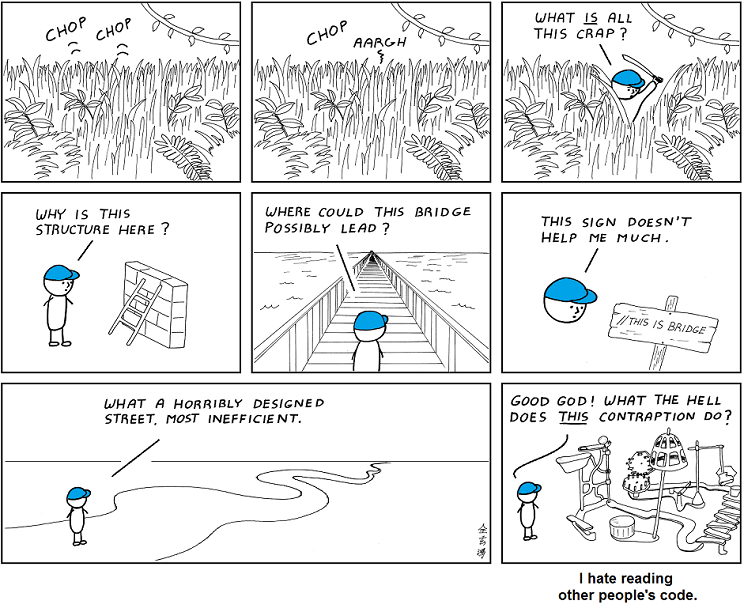
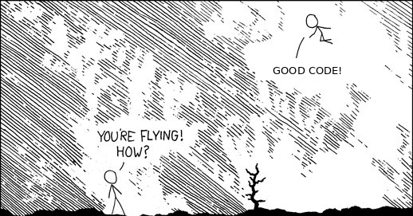

<!-- _class: lead -->

## Do More with Less Work when 
## You Code

<br>

#### Ofir Pele

---

## Others Code – What Does It Feel Like?

<br>
<center>

<br>
From: <a href="https://github.com/s-macke/Abstruse-Goose-Archive/blob/master/comics/you_down_wit_OPC-yeah_you_know_me.png">Abstruse Goose Archive</a>
</center>


---


## Good Code – What Does It Feel Like?

<br>
<center>

<br>
Adapted from: https://xkcd.com/353/
</center>


---

## Good Code – "I Know It When I See It"

<br>
<br>
<center>

<br>
Potter Stewart, 1964
</center>

---

## How to Be a Good Programmer

- 😘 KISS: Keep It Simple, Stupid
- 🏜️ DRY: Don't Repeat Yourself (and Others)
- 🚮 YAGNI: You Aren't Gonna Need It (and You Don't Need It Anymore)

---

## How to Be a Good Programmer

- Break problems down
- Code should be:
  <b style="margin-left: 3em; margin-top: 0; margin-bottom: 0; color: green">easy to use correctly</b>
  <p style="margin-left: 6.7em; margin-top: 0; margin-bottom: 0">and</p>
  <b style="margin-left: 3em; margin-top: 0; margin-bottom: 0; color: red">hard to use incorrectly</b>
- Test before implementation:
  <b style="margin-left: 3em; margin-top: 0; margin-bottom: 0; color: green">easy to test ⇒ easy to use</b>

---

<!-- _class: lead -->

### Program Style

---

## Program Style

- **Very important** - Take the time for it
- If not followed, your code will be "write only"
- Common sense
- Use formatters, linters, ... e.g., ruff, ty
- Refactor: rewrite, more on this later
- (Optional) Read "real" coding guidelines – will give you insight into how important it is
  - e.g., [Microsoft](https://docs.microsoft.com/en-us/dotnet/csharp/fundamentals/coding-style/coding-conventions) or [Google](https://google.github.io/styleguide/)

---

## What's in a Name – Constants

<b style="color:red">Bad:</b>

```c
#define ONE 1
#define TEN 10
#define TWENTY 20
```

<b style="color:green">Good:</b>

```c
#define INPUT_MODE 1
#define INPUT_BUFSIZE 10
#define OUTPUT_BUFSIZE 20
```

---

## What's in a Name – Descriptive Names

```c++
auto num_pending = 0;
```

---

## What's in a Name – Naming Conventions

Naming conventions vary (style):
- `num_pending`
- `numPending` 
- `NumberOfPendingEvents`

**Be consistent**, use ruff

---

## What's in a Name – Wording

- `noOfItemsInQ`
- `frontOfTheQueue`
- `queueCapacity`

The word "queue" appears in 3 different ways

---

### What's in a Name – Short *vs.* Long & Idioms

<b style="color:red">Bad Example:</b>

```c++
auto elementArray = vector<int>(numberOfElements, 0);
for (theElementIndex = 0; theElementIndex < numberOfElements; theElementIndex++)
    elementArray[theElementIndex] = theElementIndex;
```

<b style="color:green">Idiom (but not perfect):</b>

```c++
auto x = vector<int>(n, 0);
for (size_t i = 0; i < x.size(); ++i) {
    x[i] = i;
}
```

---

### What's in a Name – Short *vs.* Long & Idioms

<b style="color:green">One modern idiom:</b>

```c++
for (int i = 0; auto& x_i : x) {
    x_i = i;
    ++i;
}
```

<b style="color:green">Idiom in Armadillo library:</b>

```c++
vec x = regspace(0, n);
```

---

### What's in a Name – Short *vs.* Long & Idioms

<b style="color:red">Bad Example:</b>

```python
x = []
for i in range(n): 
    x.append(i)
```

<b style="color:green">Idioms:</b>

```python
x = list(range(n))
x = [(i) for i in range(n)]
x = np.arange(n)
```

---

## What's in a Name – Active Names

Use active names for functions:

```c
if (isdigit(c)) ...     // ✅ clear
if (checkdigit(c)) ...  // ❌ unclear
```

Accurate active names make bugs apparent

---

## Indentation – Show Structure

<b style="color:red">Bad:</b>

```c
for(size_t i=0; i <100; x[i++] = 0);
   c = 0; return '\n';
```

<b style="color:orange">Better (but still not good):</b>

```c
for (size_t i = 0; i < 100; i++) {
    x[i] = 0;
}
c = 0;
return '\n';
```

---

### Statements – Use Indentation and Braces in C/C++

<b style="color:red">Bad:</b>

```c
if (i < 100) x = i; i++;
```

<b style="color:orange">Better (but still not good):</b>

```c
if (i < 100) {
    x = i;
}
i += 1;
```

---

## Expressions – Use Parentheses

<b style="color:red">Bad:</b>

```c
leap_year = y % 4 == 0 && y % 100 != 0
            || y % 400 == 0;
```

<b style="color:green">Better:</b>

```c
bool is_leap_year(unsigned int year) {
    return ((year % 4 == 0) && (year % 100 != 0)) || (year % 400 == 0);
}
```

<b style="color:green">Best:</b> dedicated year type

---

### Use Else-If Chains for Multiway Decisions

```c
if (cond1) {
    statement1;
} else if (cond2) {
    statement2;
} else if (cond3) {
    statementn;
} else {
    default_statement;
}
```

---

## Flatten Nested Conditions

<b style="color:red">Nested, Bad:</b>

```c
if (x > 0)
    if (y > 0)
        if (x + y < 100) { ... }
        else printf("Sum too large!\n");
    else printf("y too small!\n");
else printf("x too small!\n");
```

---

## Flatten Nested Conditions

<b style="color:green">Flat, Good:</b>

```c
if (x <= 0) {
    printf("x too small!\n");
} else if (y <= 0) {
    printf("y too small!\n");
} else if (x + y >= 100) {
    printf("Sum too large!\n");
} else {
    ...
}
```

---

## C Switch

```c
switch (direction) {
    case NORTH: y++; break;
    case SOUTH: y--; break;
    case EAST:  x++; break;
    case WEST:  x--; break;
    default:    printf("Invalid direction!\n"); break;
}
```

---

## Python Match

```python
match direction:
    case "north":
        y += 1
    case "south":
        y -= 1
    case "east":
        x += 1
    case "west":
        x -= 1
    case _:
        raise AssertionError
```

---

## Comments – Don't State the Obvious

<b style="color:red">Bad:</b>

```c
// return SUCCESS
return SUCCESS;

// Initialize total to number_received
total = number_received;
```

---

### Rewrite Bad Code Instead of Explaining It

<b style="color:red">Bad:</b>

```c
// If result = 0 a match was found so return
// true; otherwise return false;
return !result;
```
<b style="color:green">Good:</b>

```c
return is_match;
```

---

## Code Tells a Story

<br>
<br>

<p style="text-align: center">Every line (or at least several lines)</p>
<p style="text-align: center">should be <b style="color: green">self-explanatory</b></p>
<p style="text-align: center">about <b style="color: green">what</b> it does</p>
<p style="text-align: center">even if we don't understand <b style="color: red">how</b></p>

---

## Refactoring

<br>
<br>

<p style="text-align: center">Rewriting your code to improve style is</p>
<p style="text-align: center; color: green; font-weight: bold">very important</p>
<br>
<br>

---

## Style Recap

- Descriptive names
- Clarity in expressions
- Straightforward flow
- Readability of code & comments
- Consistent conventions & idioms
- Refactoring to improve

---

## Why Bother?

<b style="color: green">Good style:</b>
- Easy to understand code
- Smaller & polished
- Makes errors apparent

<b style="color: red">Sloppy style:</b>
- Hard to read
- Broken flow
- Harder to find and correct errors

---

<!-- _class: lead -->

### Assert & Design by Contract

---

## Assert – When to Use

**Use for:**
- Catching bugs

**Don't use for:**
- Checking user input
- Memory allocation requests
- External data validation

---

## Assert – Example

```c
#include <cassert>

double sqrt(double x) {
    assert(x >= 0);
    ...
}
```

---

## Assert – Benefits

- Declare implicit assumptions
- Sanity checks in code
- Check for violations during debugging/testing
- C/C++: zero cost at runtime
- Python: comment out / delete lines starting with assert

---

<!-- _class: lead -->

### Compiling Warnings, Linters, Formatters

---

### Why Do We Need Compiling Warnings, Linters, Formatters

<br>
<center>

<br>
<b>"Keep us safe, as if we are children"</b>
<br>
Written by Bezalel Aloni and sung by Ofra Haza
</center>


---


## Tools

- C/C++: Add `-Wall` flag to catch things like this:

```c
if (i = 0) {  // bug, we meant i == 0
    ...
}
```

- Python: ruff, ty

- <b style="color:red">Legal but probably a bug</b> – the compiler/linter will warn you

- Force <b style="color:green">consistency</b>
  
---

<!-- _class: lead -->

### Test Driven Development

---

## The Testing Problem

**Programmers should write tests**

But few do. Why?
- "I am so busy"
- "It is difficult"

---

## Why Use a Testing Framework?

**Disadvantages:**
- "I need to learn a new thing" – *True, but done once, and it is very simple*
- "You don't have time for all that extra work" – *False*

Experiments repeatedly show that test suites **reduce debugging time** more than the time spent building the test suite

---

## Advantages of Test Suites

- Many fewer bugs
- Easier to catch bugs if you have them
- A lot easier to maintain and modify your program

This is a **huge win** for programs that, unlike class assignments, get actual use!

---

## Recommended TDD Approach

1. Design your code and write a stub for all functions
2. Write tests that fail for all functions
   - If hard to use the functions → return to step 1
3. For all units (functions, classes, etc.):
   - For all usage scenarios:
     - Write a test for the scenario
     - Replace stub with code, just enough to pass the test
     - Run the test
     - If fails, debug until it passes
4. Whenever you change code or find a bug → add a test

---

## Refactoring

- **Purpose:** Make code easier to understand, more efficient (only if needed!)
- **Why needed:** Code tends to become messy
- **Rule:** Should not change the functionality
- **Benefit:** Automated testing simplifies refactoring – you can verify the changed code still passes tests

---

## Unit Tests – What They Are

- Test each unit of a program **separately**
- Test that it fulfills its **contract**
- Writing tests – part of the coding (before implementation)
- Running tests – part of the build process
- Tests produce output only when they fail

---

## Unit Tests – What They're Good For

- Save debugging time
- Find problems in design early
- Help build modular code
  - *If hard to find units → not modular*
- Make refactoring easy
- Easier to work in teams
- Live documentation (*vs.* dead and smelly)
- Everybody writes some kind of tests – using a framework saves time

---

## Black Box Testing

Checks only that the **output is as expected** for the input, without checking internals

**Example:** Test an efficient and complex algorithm against a simple, obviously correct implementation

---

<!-- _class: lead -->

### Debugging

---

## Debugging 101

- **Define** the bug – reproduce it
- Use debugger and/or printouts (and other tools like valgrind)
- **Don't panic** – think!
- **Divide & Conquer**
- **Test before** instead of debugging after
- **Add test** for bug once fixed

---

## Debugger

**Features:**
- See how the program runs and the value of variables
- Breakpoints, break on expression changes
- Stack trace: very helpful for seg faults

<b style="color: red">⚠️ Danger:</b> Debuggers (and AI) tend to make people <b style="color: red">not think</b> about the problem

Many excellent programmers don't use a debugger – they use "debugging in your mind"

---

<!-- _class: lead -->

### Optimization

---

## On Premature Optimization

<br>
<br>
<center>

<br>
"<b style="color: red">Premature</b> optimization is the root of all <b style="color: red">evil</b>"
<br>
Donald Knuth
</center>

---

## So What to Do?

1. **Check if you need to optimize**
2. **Profile:** check where to optimize
3. Use a **compiled language** (C++, Rust, etc.)
4. Remember to **turn off debugging** (`#define NDEBUG`)
5. Check what your **compiler can do** for you on your specific hardware
   - `-O3 -march=pentium4 -mfpmath=sse`
   - Function inlining
6. Use common techniques (cache, etc.)

---

<!-- _class: lead -->

### Number Representations

---

## Important: Check, Don't Guess

If you need to know the representation – **check, don't guess**

---

## Integer *vs.* Floating Point

```python
1   + 2   == 3    # TRUE ✅
0.1 + 0.2 == 0.3  # FALSE ❌
```

---

## Special Floating Point Values

```python
1.0 / 0.0 == 1.0 / 0.0  # TRUE ✅ (C++, numpy)
                        # Exception 💣 (Python)

0.0 / 0.0 == 0.0 / 0.0  # FALSE ❌ (C++, numpy)
                        # Exception 💣 (Python)
```

---

## Beware of Edge Cases

- <b style="color:red">Overflows</b> and <b style="color:red">rounding errors</b> (numeric stability)
- <b style="color:red">Comparison with `==` for floating point </b>

Remember the special values and beware of unexpected behaviors:
- `NaN != NaN`
- IEEE 754 has signed zeros: `-0.0` and `+0.0`

---

## Integer-Float Conversion Limits

- We won't necessarily be able to represent all integers $A$ with floating-point $B$

- Even if $\#\text{bits}(A) \leq \#\text{bits}(B)$

- We can represent integers up to $2^{(\text{mantissa bits} + 1)} + 1$

---

<!-- _class: lead -->

### Program Design

---

## Interfaces

A definition of a set of functions that provide a coherent module (or library):

- **Data structure** (e.g., list, binary tree)
- **User interface** (e.g., drawing graphics)
- **Communication** (e.g., device driver)

---

## Interface — Modularity

Hide the implementation details of the module from its users

- **Specification** – "what"
- **Implementation** – "how"

---

## Interface — Information Hiding

Hide "private" information from the outside:
- The "outside" program should not be able to use internal variables of the module
- Crucial for modularity

**Resource management:**
- Define who controls allocation of memory (and other resources)

---

### Interface Principles — Hide Implementation

**Hide data structures:**
- Don't provide access to data structures that might be changed in alternative implementations
- A "visible" detail cannot be later changed without changing code using the interface

---

### Interface Principles — Minimal Primitives

Use a small set of "primitive" actions:
- Provide a minimal set of operations to maximize functionality
- Don't provide unneeded functions "just because you can"

**How much functionality?**
- **Minimal** – for a few users, don't waste your time
- **Maximal** – when many users will use it (e.g., OS)

---

## Interface Principles — No Surprises

**Don't reach behind the back:**
- Don't use global variables unless you must
- Don't have unexpected side effects
- Enforce assumptions

---

## Interface Principles — Consistency

**Do similar things in a similar way**

```c
strcpy(dest, source);
memcpy(dest, source, n);
```

Both follow the same parameter order convention

---

### Interface Principles — Resource Management

- Free a resource at the same level as it was allocated
- The one who allocates the resource is responsible for freeing it
- Be explicit about assumptions regarding resources

---

<!-- _class: lead -->

### What About AI?

---

## AI

- Disclaimer: we are all newbies
- Similar to working with a weak programmer
- Rarely, it does something extremely stupid
- Even more rarely, it does something truly smart
- The main advantage: it is fast — blazingly fast 🏎️💨
- Using it with good code is fun

---

### Good Code with AI – What Does It Feel Like?

<br>
<center>

<br>
Adapted from: https://xkcd.com/353/
</center>

---

## Take Home Messages

- **Use common sense**
- **KISS, DRY, YAGNI**
- **Break problems down**
- **Tell a (simple) story**
- **Design clean interfaces**
- **Don't optimize prematurely**

---

## Take Home Messages

- **Be consistent**
- **Use formatters and linters**
- **Assert**
- **Use TDD**
- **Refactor**

